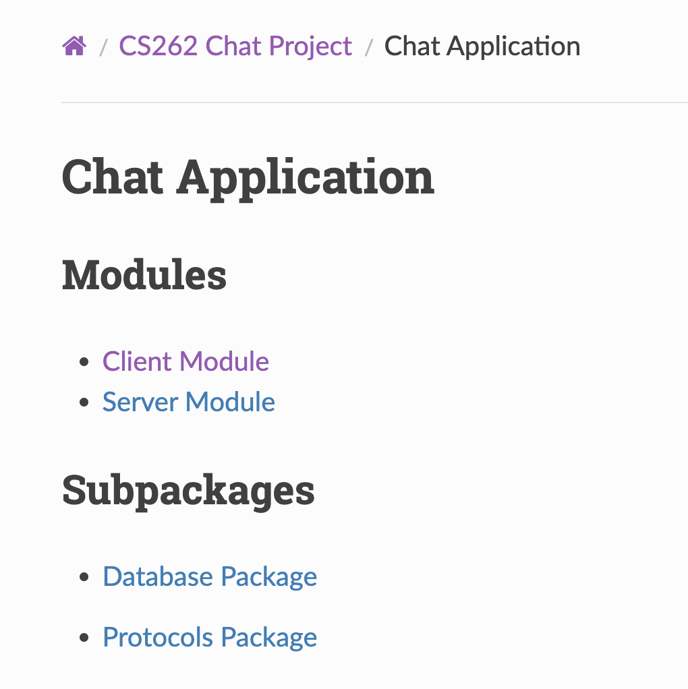

# Chat Application with Custom Wire Protocol and gRPC

A client-server chat application that implements both a custom wire protocol, JSON-based communication, and gRPC for message exchange. This project was developed as part of Harvard's CS262 course.

## Project Structure
```
.
├── README.md
├── requirements.txt
├── src/
│   ├── __init__.py
│   ├── server.py (socket-based)
│   ├── chat_grpc_server.py (gRPC-based)
│   ├── client.py (socket-based)
│   ├── chat_grpc_client.py (gRPC-based)
│   ├── database/
│   │   ├── __init__.py
│   │   └── db_manager.py
│   └── protocols/
│       ├── __init__.py
│       ├── base.py
│       ├── binary_protocol.py
│       ├── json_protocol.py
│       └── grpc/
│           ├── chat.proto
│           ├── chat_pb2.py
│           ├── chat_pb2.pyi
│           └── chat_pb2_grpc.py
├── docs/                  # Documentation files
├── pyproject.toml        # Project configuration
├── Pipfile              # Dependencies
├── tests/
│   ├── __init__.py
│   ├── test_binary_protocol.py
│   ├── test_json_protocol.py
│   ├── test_grpc_protocol.py
│   ├── test_server.py
│   └── test_client.py
│   ├── test_protocols.py     # Protocol tests
│   └── test_database.py      # Database tests
├── app.py (Streamlit UI for socket-based)
└── grpc_app.py (Streamlit UI for gRPC)

```

## Architecture

The application is built with a layered architecture supporting both traditional socket-based protocols and gRPC:

### Server Layer
- `server.py` (socket-based): Handles client connections and message routing using traditional sockets
- `chat_grpc_server.py` (gRPC-based): Implements the same functionality using gRPC services

### Client Layer
- `client.py` (socket-based): Manages user connections and message handling using traditional sockets
- `chat_grpc_client.py` (gRPC-based): Implements the same functionality using gRPC client stubs

### Protocol Layer
- Base Protocol (`protocols/base.py`): Defines the interface for all protocols
- JSON Protocol (`protocols/json_protocol.py`): JSON-based message serialization
- Binary Protocol (`protocols/binary_protocol.py`): Binary-based message serialization
- gRPC Protocol (`protocols/grpc/`): Protocol Buffers definitions and generated code

### Database Layer
- `database/db_manager.py`: Handles all database operations for both implementations

### User Interface
- `grpc_app.py`: Streamlit-based UI supporting both traditional and gRPC implementations
- `app.py`: Streamlit-based UI supporting socket-based implementation

## Running the Application

1. Install Pipenv if you haven't already:
```bash
pip install pipenv
```

2. Install project dependencies:
```bash
pipenv install
```

### Traditional Socket-based Version

1. Start the server:
```bash
# Activate the virtual environment
pipenv shell

# Run the server (default port: 8000)
python -m src.server [--port PORT] [--protocol {binary,json}]
```

2. Start the client:
```bash
# In a new terminal, activate the virtual environment
pipenv shell

# Run the Streamlit app (default port: 8501)
streamlit run app.py -- [—-host HOST] [—-port PORT] [—-protocol {JSON, Binary}]
```

### gRPC Version

To generate the gRPC code from the proto definitions:
```bash
# Generate Python gRPC code
python -m grpc_tools.protoc -I. --python_out=. --pyi_out=. --grpc_python_out=. src/protocols/
grpc/chat.proto
```

2. Start the gRPC server:
```bash
# Activate the virtual environment
pipenv shell

# Run the gRPC server (default port: 8000)
python -m src.chat_grpc_server [--port PORT]
```

3. Start the gRPC client:
```bash
# Activate the virtual environment
pipenv shell

# Run the Streamlit app (default port: 8501)
streamlit run grpc_app.py -- [—-host HOST] [—-port PORT]
```

## Testing Guide

The project uses pytest for testing with the following structure:

### Test Organization

```
tests/
├── conftest.py           # Shared test fixtures and configurations
├── test_server.py        # Socket-based server tests
├── test_grpc_server.py   # gRPC server tests
├── test_client.py        # Socket-based client tests
├── test_grpc_client.py   # gRPC client tests
├── test_protocols.py     # Socket protocol tests (JSON/Binary)
├── test_grpc_protocol.py # gRPC protocol tests
└── test_database.py      # Database operation tests
```

### Key Test Components

1. **Server Tests**
   Socket-based (`test_server.py`):
   - WebSocket connection handling
   - Protocol message processing
   - Concurrent client management
   - Error handling and recovery

   gRPC (`test_grpc_server.py`):
   - gRPC service implementation
   - Streaming message handling
   - Connection management
   - Error handling

2. **Client Tests**
   Socket-based (`test_client.py`):
   - Message serialization/deserialization
   - Connection management
   - UI state management
   - Error handling

   gRPC (`test_grpc_client.py`):
   - Client stub operations
   - Streaming message handling
   - Connection management
   - Error handling

3. **Protocol Tests**
   Socket-based (`test_protocols.py`):
   - Message serialization/deserialization
   - Protocol message processing
   - Error handling

   gRPC (`test_grpc_protocol.py`):
   - Protocol buffer message handling
   - Service method testing
   - Stream processing
   - Error handling

4. **Database Tests**
   - CRUD operations
   - Transaction management
   - Concurrent access
   - Data integrity

### Running Tests

1. Run all tests:
```bash
pipenv run pytest
```

2. Run specific implementation tests:
```bash
# Socket-based implementation tests
pipenv run pytest tests/test_server.py tests/test_client.py tests/test_protocols.py

# gRPC implementation tests
pipenv run pytest tests/test_grpc_server.py tests/test_grpc_client.py tests/test_grpc_protocol.py
```

3. Run specific test case:
```bash
pipenv run pytest tests/test_server.py::test_function_name
```

4. Run tests with coverage:
```bash
pipenv run pytest --cov=src tests/
```

5. Generate HTML coverage report:
```bash
pipenv run pytest --cov=src --cov-report=html
```
The report will be available in `htmlcov/index.html`

### Coverage Metrics

| Module | Miss | Coverage |
|--------|-----------|----------|
| src/client.py | 27 | 82% |
| src/chat_grpc_client.py | 31 | 80% |
| src/database/db_manager.py | 50 | 79% |
| src/protocols/base.py | 0 | 100% |
| src/protocols/binary_protocol.py | 0 | 100% |
| src/protocols/json_protocol.py | 0 | 100% |
| src/protocols/grpc/chat_pb2.py | 0 | 100% |
| src/server.py | 86 | 75% |
| src/chat_grpc_server.py | 82 | 77% |
| **Overall** | **276** | **83%** |

## Configuration

The application can be configured through command-line arguments and inside the streamlit interface like shown in the previous sections.

## Linting and Formatting

The project uses black and isort for code formatting, and flake8 and mypy for linting. The configuration is in `pyproject.toml`.

```bash
# Run code formatting
black . --config=./pyproject.toml
isort . --settings-file=./pyproject.toml

# Run linting
flake8 . --count --max-line-length=100 --statistics
mypy . --config=./pyproject.toml --ignore-missing-imports
```

## Documentation

The documentation now covers both socket-based and gRPC implementations:

The project uses Sphinx to automatically generate documentation from the codebase. To generate the documentation:

1. Install documentation dependencies:
```bash
pipenv install --dev sphinx sphinx-rtd-theme
```

2. Build the documentation:
```bash
cd docs
pipenv run make html
```

3. View the documentation by opening `docs/build/html/index.html` in your web browser.

### Documentation Structure



The documentation includes:
- Complete API reference
- Module listings
- Class and function documentation with source code links
- Full text search functionality
- Index of all modules, classes, and functions

### Updating Documentation

When adding new code or making changes:

1. Add Google-style docstrings to your Python functions and classes:
```python
def function_name(param1: type1, param2: type2) -> return_type:
    """Short description of what the function does.

    Args:
        param1: Description of param1
        param2: Description of param2

    Returns:
        Description of return value

    Raises:
        ErrorType: Description of when this error is raised
    """
```

2. Rebuild the documentation to reflect your changes:
```bash
cd docs
pipenv run make html
```

## Protocol Comparison

### Message Size Comparison
| Operation           | JSON Protocol | Binary Protocol | gRPC Protocol | Size vs JSON |
|--------------------|---------------|-----------------|---------------|--------------|
| CREATE_ACCOUNT     | 141 bytes     | 69 bytes        | 58 bytes     | -59%         |
| LOGIN             | 150 bytes     | 75 bytes        | 62 bytes     | -59%         |
| LIST_ACCOUNTS     | 125 bytes     | 51 bytes        | 45 bytes     | -64%         |
| SEND_MESSAGE      | 150 bytes     | 53 bytes        | 48 bytes     | -68%         |
| READ_MESSAGES     | 150 bytes     | 73 bytes        | 65 bytes     | -57%         |
| DELETE_MESSAGES   | 127 bytes     | 54 bytes        | 42 bytes     | -67%         |
| DELETE_ACCOUNT    | 100 bytes     | 28 bytes        | 25 bytes     | -75%         |
| LIST_CHAT_PARTNERS| 100 bytes     | 28 bytes        | 24 bytes     | -76%         |

### Performance Analysis
Average processing times (in milliseconds):

**Serialization:**
- JSON: 0.070ms (avg)
- Binary: 0.026ms (avg)
- gRPC: 0.018ms (avg)
- Performance gain vs JSON: ~74% faster with gRPC

**Deserialization:**
- JSON: 0.133ms (avg)
- Binary: 0.033ms (avg)
- gRPC: 0.025ms (avg)
- Performance gain vs JSON: ~81% faster with gRPC

### Key Findings
- Binary protocol achieves 50-72% reduction in message size vs JSON
- gRPC protocol achieves 57-76% reduction in message size vs JSON
- Binary serialization is ~2.7x faster than JSON
- gRPC serialization is ~3.9x faster than JSON
- Binary deserialization is ~4x faster than JSON
- gRPC deserialization is ~5.3x faster than JSON
- Most significant improvements in account and chat partner operations
- gRPC provides additional benefits like type safety and code generation

### Protocol Selection Guidelines
- Use Binary Protocol when:
  - Network bandwidth is limited
  - High-frequency message exchange is needed
  - Performance is critical
  - Protocol simplicity is desired
  
- Use JSON Protocol when:
  - Debugging/monitoring is required
  - Human readability is important
  - Interoperating with external tools
  - Quick prototyping is needed

- Use gRPC Protocol when:
  - Type safety is important
  - Cross-language compatibility is needed
  - Streaming is required
  - Maximum performance is needed
  - Auto-generated client/server code is desired
  - Built-in security features are needed
